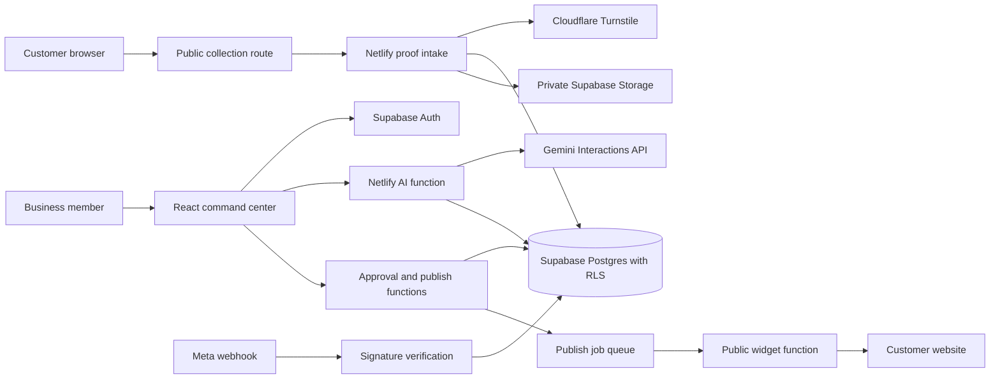

# Architecture

## Trust boundaries

1. Customer browser to public intake: untrusted input. The function validates data, requires consent, rate-limits, and verifies Turnstile before live storage.
2. Browser to Supabase: public publishable key only. Every tenant table has Row Level Security enabled.
3. Netlify functions to Supabase/Gemini/providers: server-only secrets. The service-role key never appears in Vite variables or browser bundles.
4. Publishing: an asset must have customer-publishing consent and a recorded human approval before a server function can mark any channel as published or queued.
5. Widget: only assets marked `published` and `is_public` are returned; the script uses Shadow DOM and text nodes to avoid host-page and injection issues.

## Data lifecycle

1. A customer submits text and optional small media after consenting to publication and AI processing.
2. The server stores the proof record and, if needed, creates a short-lived signed upload token for the private `proof-media` bucket.
3. An authorized workspace member selects consented proof records for AI drafting.
4. The AI function retrieves source text from the database instead of trusting browser-provided feedback, writes provenance into the asset, and creates only draft records.
5. A member records final approval. The approval function rechecks publishing consent for every source proof record.
6. Website widgets and public testimonial pages can publish immediately; external channels enter idempotent queue records until their provider integration is ready.

## Free-first choices

- Netlify hosts the app and functions.
- Supabase provides Auth, Postgres, private Storage, and RLS.
- Gemini is optional; template drafts remain available when the API key or quota is unavailable.
- Cloudflare Turnstile protects live public forms.
- Resend/Gmail, Meta WhatsApp, Twilio, and social APIs remain explicit integration boundaries. Test mode and queued jobs are intentional until account approval, policy compliance, and any required spend are in place.
